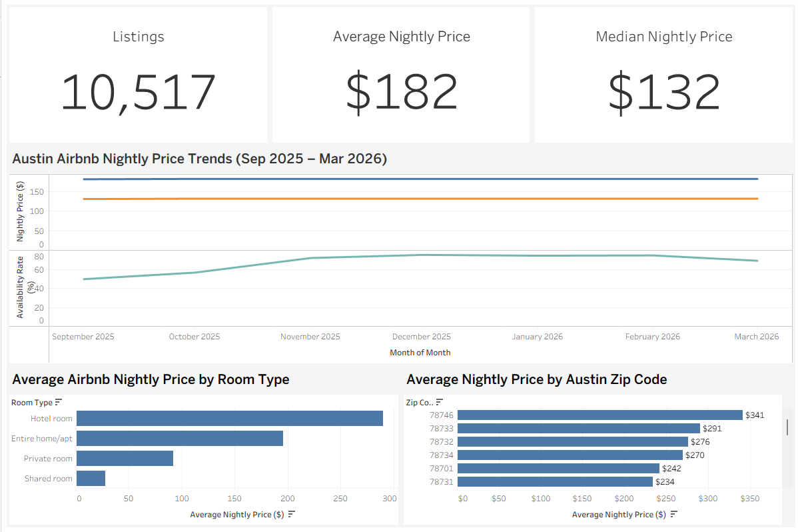

# Austin Airbnb Market Analysis

**Tools:** SQL • DuckDB • Tableau  
**Dataset Size:** 3M+ records  

This project analyzes the Austin short-term rental market using publicly available data from Inside Airbnb and presents key insights through a clean executive-style Tableau dashboard.

The goal was to examine listing supply, pricing behavior, and geographic variation across Austin neighborhoods, then translate the analysis into a dashboard format suitable for business or investment decision-making.

---

## Project Overview

Austin has one of the largest short-term rental markets in Texas, with thousands of active listings distributed across the city. Using Airbnb listing and calendar data, this analysis explores how listing type, location, and market activity influence pricing trends.

The project focuses on answering several practical questions:

• How large is the Austin Airbnb market?  
• What is the typical nightly price compared to the average?  
• How does pricing vary by room type?  
• Which areas of Austin command the highest nightly rates?  
• What trends appear in pricing and availability over time?

The final deliverable is an **executive dashboard designed to surface key metrics and trends quickly and clearly.**

---

## Dataset

Source:  
https://insideairbnb.com/get-the-data/

The raw dataset includes:

• Airbnb listing metadata  
• Daily availability and pricing records  
• Geographic location data  

Combined, the listings and calendar datasets contain **over 3 million records**.

These records were processed and aggregated to create summary tables used for analysis and visualization.

---

## Key Market Metrics

Total Listings Analyzed: **~10,500**

Average Nightly Price: **~$182**

Median Nightly Price: **~$132**

The difference between the average and median price indicates the presence of higher-priced listings that raise the average while the typical listing remains closer to the median.

---

## Key Insights

• Austin maintains a **large and competitive Airbnb market with more than 10K listings**.

• **Entire homes and apartments dominate the market**, representing the majority of listings.

• **Hotel-style listings command the highest nightly rates** on average.

• Significant **pricing variation exists across Austin ZIP codes**, highlighting geographic concentration of premium listings.

• The spread between median and average pricing suggests **premium inventory driving the upper end of the market**.

---

## Data Processing Workflow

1. Raw Airbnb datasets were downloaded from Inside Airbnb.
2. Data was loaded into DuckDB for efficient local processing.
3. SQL queries were used to aggregate listing, pricing, and availability metrics.
4. Processed summary datasets were exported as CSV tables.
5. Tableau was used to build an executive dashboard visualizing the market trends.

---

## Tools Used

SQL  
DuckDB  
Tableau  
CSV Data Processing

---

## Dashboard Preview

---

## Interactive Dashboard

View the live dashboard on Tableau Public:

[ADD_TABLEAU_PUBLIC_LINK_HERE](https://public.tableau.com/app/profile/jonathan.kennedy6398/viz/AustinAirbnbMarketOverview_17731499621220/Dashboard1)

---

## Repository Structure

austin-airbnb-market-analysis  
│  
README.md  

data/  
Processed summary datasets used for analysis

pictures/  
Dashboard preview images

---

## About This Project

This project was built as part of my broader work developing practical data analytics projects using real-world datasets. The focus is on taking large datasets, performing structured analysis using SQL, and translating the results into clear visualizations that support decision-making.
